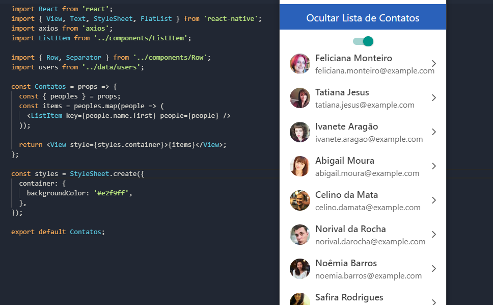

# ToggleSwitch Lista De Contatos

Welcome APP!

Tarefa 1 - Primeira aplicação React			
Estudar os conceitos principais (Main concepts) na documentação oficial do React
[https://reactjs.org/docs/hello-world.html]((https://reactjs.org/docs/hello-world.html))

Implementar uma aplicação que contém uma tela que exibe uma **lista de entidades e seus atributos**.
Na aplicação deve ter também um **botão** para **exibir e ocultar essa lista**.

Implementado com:
When you're ready to see everything that Expo provides (or if you want to use your own editor) you can **Export** your project and use it with [expo-cli](https://docs.expo.io/versions/latest/introduction/installation.html).

# Tela

	 
	
       

